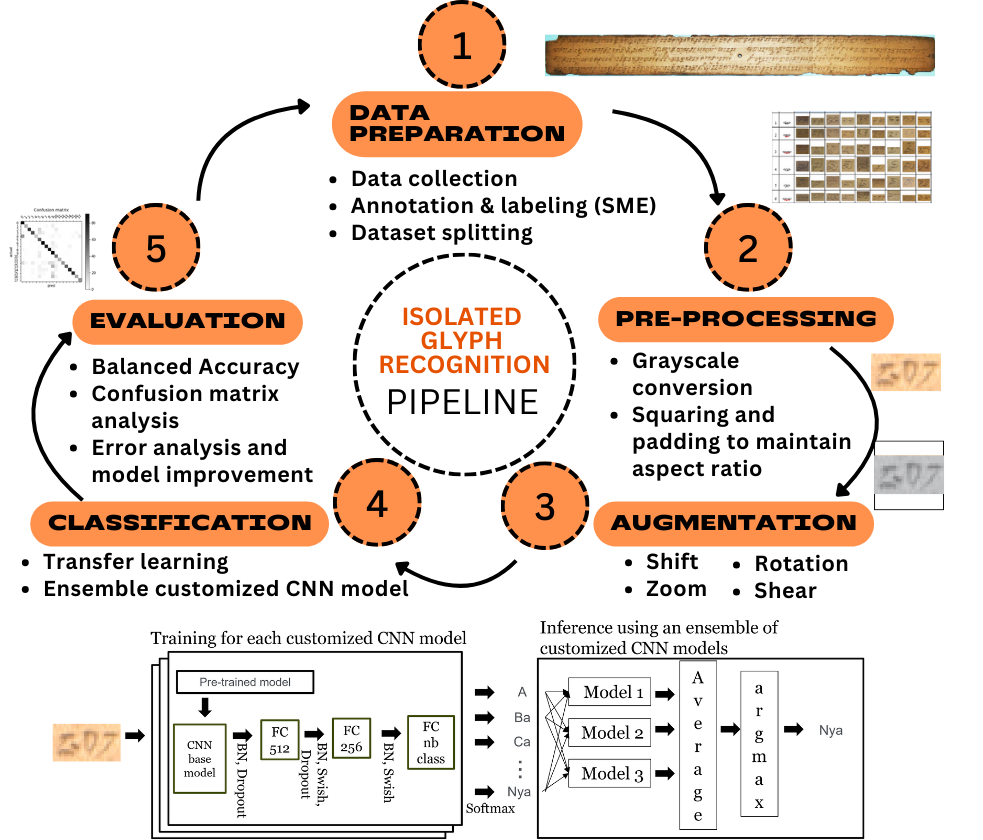
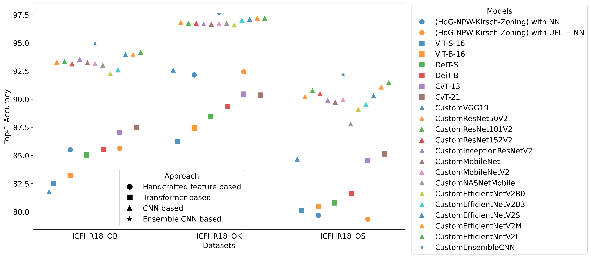

# Isolated Glyph Recognition Pipeline

This project implements a pipeline for isolated glyph recognition. The pipeline is organized into **five main steps**, designed to systematically process and classify individual glyphs with high accuracy.



## Pipeline Overview

The pipeline includes the following stages:

1. **Data Preparation**  
   - Data Collection and organization of glyph images.
   - Each image  is annotated and labeled by a subject matter expert.
   - The isolated glyphs are then split into training and test sets.
   - All training and testing sets can be downloaded [here](http://amadi.univ-lr.fr/ICFHR2018_Contest/index.php/download-1234-all)

2. **Preprocessing**  
   - Grayscale conversion 
   - Squaring, and padding are applied to standardize the input data for the CNN model
   - The code can be seen in folder [002-Preprocessing](./002-Preprocessing)


3. **Data Augmentation**  
   - Techniques such as rotation, scaling, shearing, and shifting to expand training data.
   - Helps improve model generalization.
   - The augmentation code is part of the classification code in folder 04-classification [04-classification](./04-classification)

4. **Classification**  
   - Implementation Transfer Learning and Fine tuning hyperparameters.
   - Trained Ensemble Customized CNN models.
   - The code can be seen in folder [04-classification](./04-classification)

5. **Evaluation**  
   - Performance measured using metrics like balanced accuracy, confusion matrix, .
   - Error analysis.
   The evaluation code is part of the classification code in folder 04-classification [04-classification](./04-classification)

Our experimental results demonstrate that the proposed model outperforms existing approaches in isolated glyph classification accuracy. This work lays a solid foundation for optimizing deep learning models in resource-constrained scenarios and contributes to advancing the digitization and preservation of historical documents.



## Getting Started

To run this project, follow these steps:

```bash
# Clone the repository
git clone https://github.com/your-username/isolated-glyph-recognition.git
cd isolated-glyph-recognition

# (Optional) Create and activate a virtual environment
python -m venv venv
source venv/bin/activate  # or venv\
```

## How to run preprosessing
After download the dataset from the [website](http://amadi.univ-lr.fr/ICFHR2018_Contest/index.php/download-1234-all), then unzip the file.

To run the preprocessing script, use the following command:

```
python TrainingSetConverter.py --image_dir "D:\2018ICFHR\Train-ChallengeC-Track3-Sunda\sundanese_train_image"  --img_size 224  --gray --gt --padding_color white  --dataset_prefix ICFHR18_OS

python TestSetConverter.py --image_dir "C:\2018ICFHR\Test-ChallengeC-Track3-Sundanese\sundanese_test_image" --label_file "C:\2018ICFHR\Evaluation-ChallengeC-Track3-Sundanese/sundanese_gt_test.txt" --img_size 224 --gray --gt --padding_color white --dataset_prefix ICFHR18_OS
```

## How to run training
```
python ExpModifiedCNNV1.py --dataset ICFHR18_OB --nb_class 133 --model_index 12 --resize_meth bilinear --color_pad gray_white --img_size 75  --path_out expExpModifiedCNNV1OB_gray_white --weight 'imagenet'
```

## How to run inference
```
python InferenceEnsembelModifiedCNNV1ConvMetNonPersent.py --dataset ICFHR18_OS --nb_class 60 --resize_meth bilinear --color_pad gray_white --img_size 75  --path_out InferenceEnsembelModifiedCNNV1ConvMetNonPersent_gray_white --weight imagenet
```